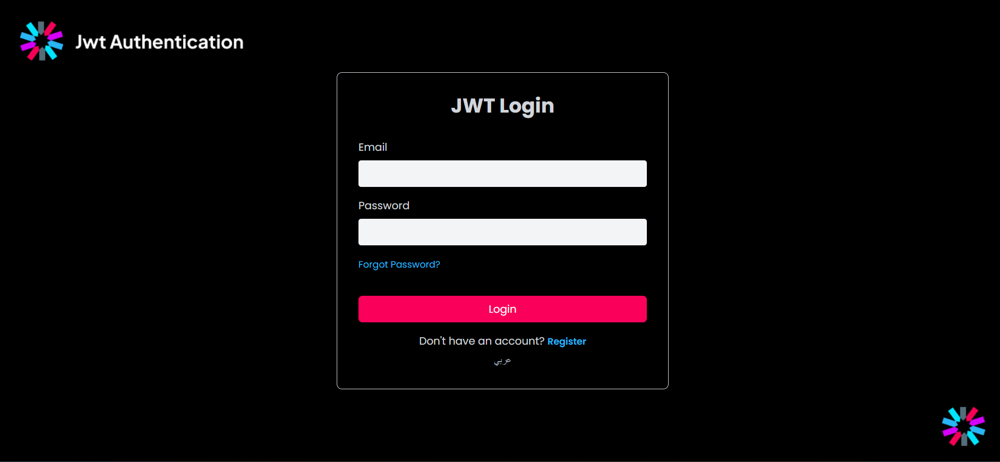
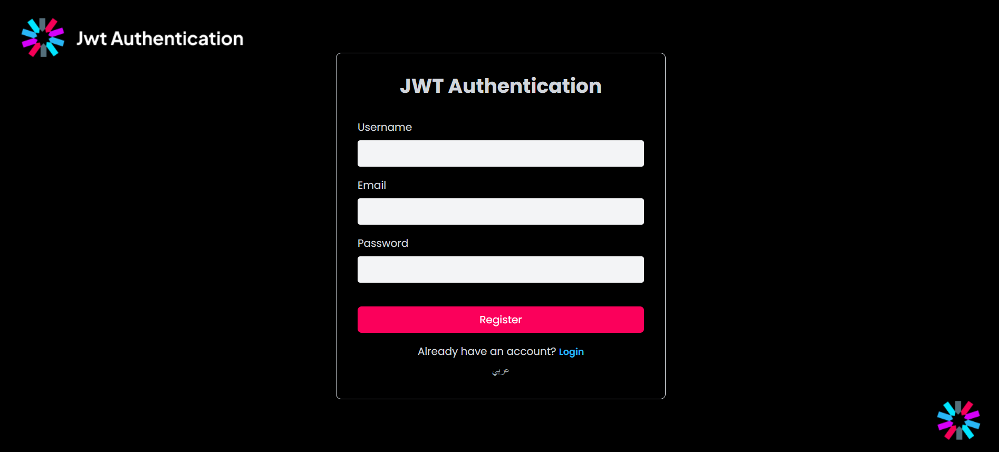
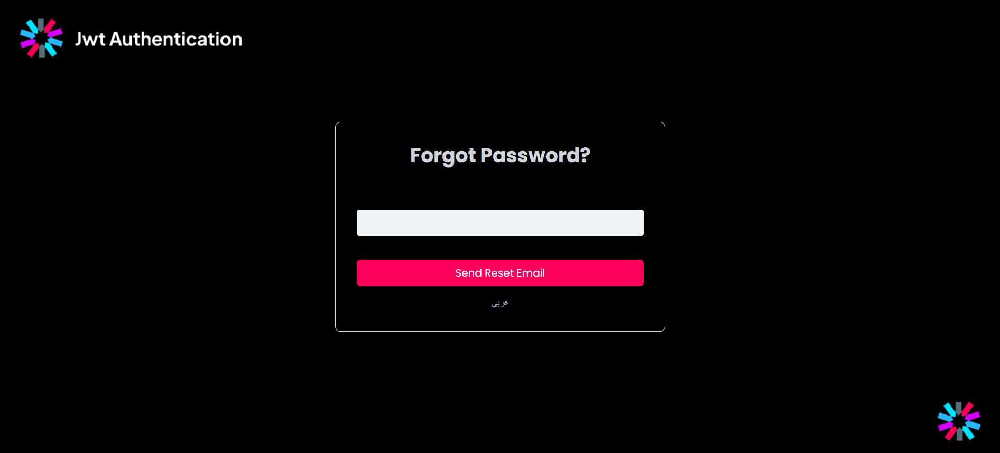
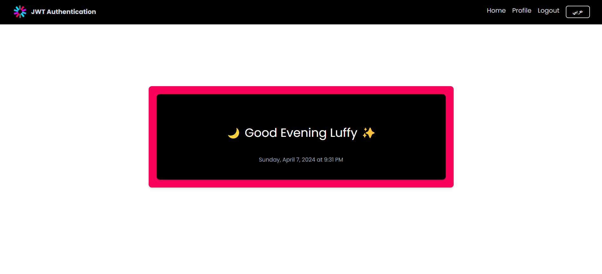
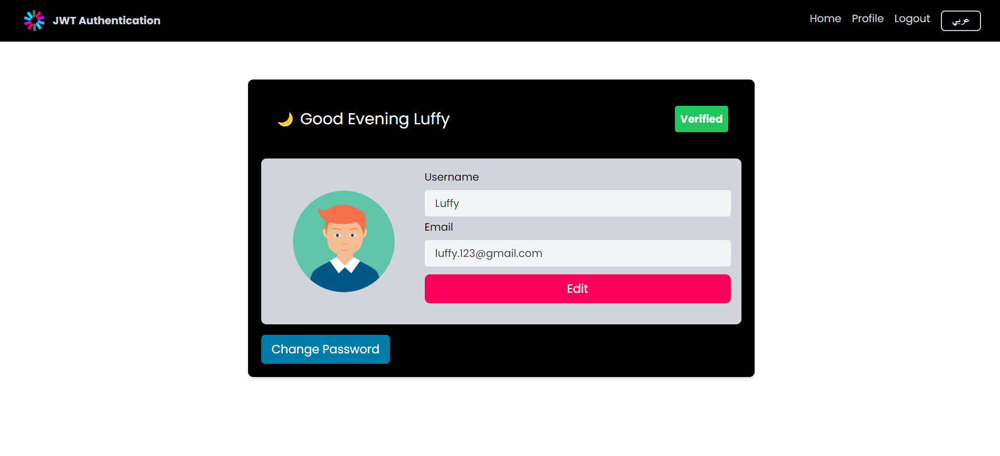

<h1 align="center">A MERN Stack Platform with JWT Authentication</h1>

## Description

This is a MERN Stack web application built with React.js for the frontend, Node.js and Express.js for the backend, and MongoDB for the database. The application implements secure user authentication and authorization using JSON Web Tokens (JWT). It features a user-friendly interface for login, registration, and password recovery, along with profile management capabilities such as viewing and editing profile details. The app is designed to provide a seamless and secure user experience with scalable and efficient backend architecture.

# App Screenshots for Web Application

## Login Screen

## Register Screen

## Forgot Password Screen

## Home Screen

## Profile Screen

 

## Project Structure 📁

This structure promotes a clear separation of concerns and facilitates easier management and extension of the codebase.

## Technologies 🛠️

This project leverages the following technologies:

- **MongoDB**: A NoSQL database used for storing data in a flexible, JSON-like format.
- **Express.js**: A minimal and flexible Node.js web application framework for building robust backend APIs.
- **React.js**: A JavaScript library for building dynamic and interactive user interfaces.
- **Node.js**: A JavaScript runtime environment for building scalable and high-performance server-side applications.
- **JWT (JSON Web Tokens)**: A compact, URL-safe token format used for securely transmitting information and managing user authentication.
- **Axios**: A popular HTTP client used to make API requests in a promise-based manner.
- **Redux**: A state management library for managing the application state in a predictable way (alternatively, can be used with React context or other state management libraries).
- **Bcrypt.js**: A library for hashing passwords securely before storing them in the database.
- **JWT Authentication**: A secure method for handling user authentication and authorization in a stateless manner.

These technologies work together to create a robust and scalable application.
